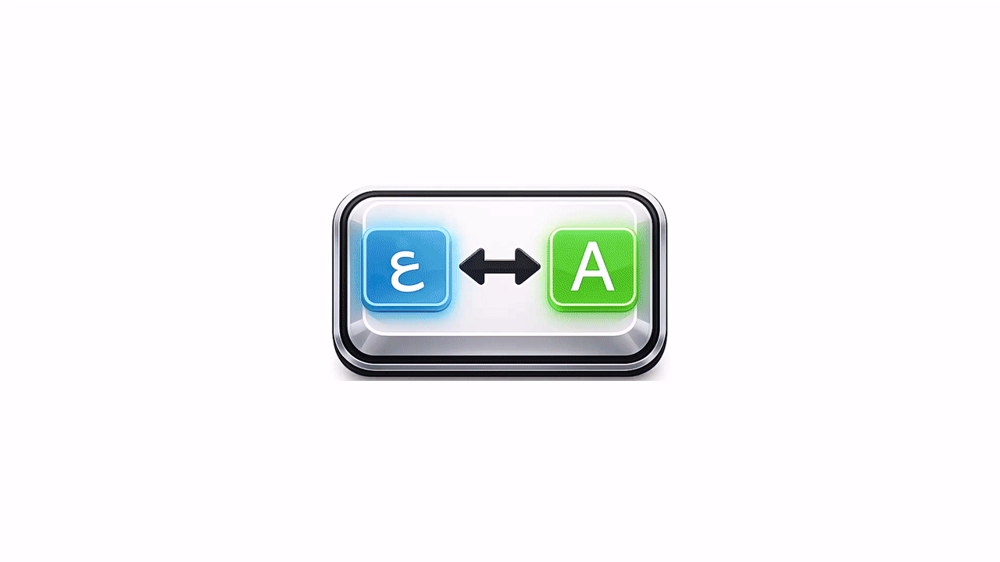

# مبدل اللغة التلقائي

امتداد لـ Visual Studio Code يقوم تلقائياً بتبديل لغة لوحة المفاتيح بين العربية والإنجليزية بناءً على النص الذي تكتبه.



## المطور

**عبدالكافي الحسن**

## المنصات المدعومة

- ✅ macOS
- ✅ Windows
- ✅ Linux

## الميزات

- **الكشف التلقائي**: يكتشف لغة النص الذي تكتبه ويقوم بتبديل تخطيط لوحة المفاتيح وفقاً لذلك
- **التبديل عند الانتقال لسطر جديد**: يقوم بالتبديل فقط عند الانتقال لسطر جديد لتجنب التبديل المتكرر
- **مؤشر شريط الحالة**: يعرض اللغة المكتشفة حالياً في شريط الحالة
- **أمر التبديل**: تمكين أو تعطيل الامتداد بأمر بسيط
- **إشعارات قابلة للتخصيص**: اختر ما إذا كنت تريد استلام إشعارات عند تغيير اللغة

## المتطلبات

- Visual Studio Code 1.60.0 أو أحدث
- نظام تشغيل macOS أو Windows أو Linux
- تثبيت تخطيطات لوحة المفاتيح العربية والإنجليزية على نظامك

## التثبيت

### الطريقة 1: من ملف VSIX (موصى به)

1. قم بتحميل ملف `autolanguage-1.0.0.vsix`
2. افتح VS Code
3. اذهب إلى قائمة الامتدادات (Extensions)
4. اضغط على "..." في الزاوية العلوية
5. اختر "Install from VSIX..."
6. حدد ملف `autolanguage-1.0.0.vsix`

### الطريقة 2: من سطر الأوامر

```bash
code --install-extension autolanguage-1.0.0.vsix
```

## الاستخدام

بمجرد التثبيت، سيقوم الامتداد تلقائياً بـ:
- اكتشاف لغة النص عند الانتقال لسطر جديد
- تبديل تخطيط لوحة المفاتيح لمطابقة اللغة المكتشفة
- عرض الإشعارات عند تغيير اللغة (إذا كان مفعلاً)

### كيف يعمل

1. اكتب نص بالعربية في سطر
2. انتقل لسطر جديد
3. سيقوم الامتداد تلقائياً بالتبديل إلى لوحة المفاتيح العربية
4. اكتب نص بالإنجليزية في سطر جديد
5. سيقوم الامتداد تلقائياً بالتبديل إلى لوحة المفاتيح الإنجليزية

### الأوامر

- **تبديل مبدل اللغة التلقائي**: تمكين أو تعطيل الامتداد

### الإعدادات

يمكنك تكوين الامتداد في إعدادات VS Code:

| الإعداد | النوع | الافتراضي | الوصف |
|---------|------|---------|-------------|
| `autolanguage.enabled` | boolean | `true` | تمكين أو تعطيل مبدل اللغة التلقائي |
| `autolanguage.showNotifications` | boolean | `true` | عرض الإشعارات عند تبديل اللغة |
| `autolanguage.showStatusBar` | boolean | `true` | عرض عنصر شريط الحالة مع اللغة الحالية |

## الإعداد الخاص بالمنصة

### macOS

تأكد من تثبيت تخطيطات لوحة المفاتيح العربية والإنجليزية:
1. افتح تفضيلات النظام
2. اذهب إلى لوحة المفاتيح → مصادر الإدخال
3. انقر على زر + لإضافة مصادر إدخال عربية وإنجليزية

### Windows

تأكد من تثبيت تخطيطات لوحة المفاتيح العربية والإنجليزية:
1. افتح إعدادات Windows
2. اذهب إلى الوقت واللغة → الكتابة
3. انقر على "إعدادات لوحة المفاتيح المتقدمة"
4. أضف تخطيطات لوحة المفاتيح المطلوبة

### Linux

تأكد من توفر أحد التالي:
- **GNOME**: gsettings (مثبت مسبقاً عادةً)
- **X11**: setxkbmap
- **IBus**: ibus
- **Fcitx**: fcitx-remote

لإضافة تخطيطات لوحة المفاتيح على Linux:
- **GNOME**: الإعدادات → لوحة المفاتيح → مصادر الإدخال
- **بيئات سطح المكتب الأخرى**: استخدم إعدادات لوحة المفاتيح في توزيعتك

## استكشاف الأخطاء وإصلاحها

### تخطيط لوحة المفاتيح غير موجود

إذا رأيت رسالة خطأ تقول "تخطيط لوحة المفاتيح غير موجود"، تأكد من تثبيت تخطيطات لوحة المفاتيح العربية والإنجليزية على نظامك.

### الامتداد لا يعمل

1. تحقق من تمكين الامتداد في الإعدادات
2. تأكد من تثبيت تخطيطي لوحة المفاتيح
3. تحقق من لوحة إخراج VS Code بحثاً عن رسائل خطأ

### مشاكل خاصة بـ Linux

إذا لم يعمل الامتداد على Linux، جرب تثبيت أحد التالي:
```bash
# لـ GNOME
sudo apt install gsettings-desktop-schemas  # Ubuntu/Debian
sudo dnf install gsettings-desktop-schemas  # Fedora

# لـ X11
sudo apt install x11-xkb-utils  # Ubuntu/Debian
sudo dnf install xorg-x11-utils  # Fedora

# لـ IBus
sudo apt install ibus  # Ubuntu/Debian
sudo dnf install ibus  # Fedora

# لـ Fcitx
sudo apt install fcitx  # Ubuntu/Debian
sudo dnf install fcitx  # Fedora
```

## الترخيص

MIT

## الدعم

إذا واجهت أي مشاكل أو كان لديك اقتراحات، يرجى فتح Issue في المستودع.

---

**صنع بـ ❤️ بواسطة عبدالكافي الحسن**
