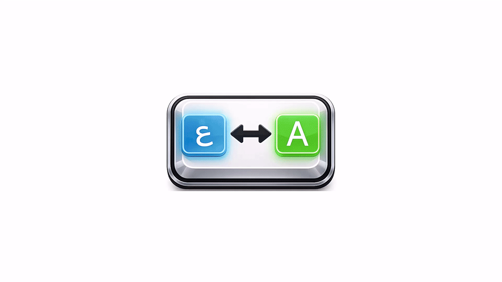
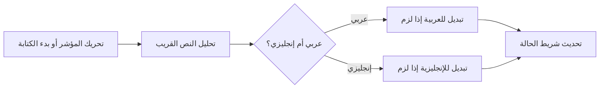

<div align="center">

# 🌐 مبدّل اللغة التلقائي لـ VS Code

<div align="center">


</div>

### إضافة ذكية تقوم بالتبديل التلقائي بين العربية والإنجليزية حسب النص القريب من المؤشر

<div align="center">



</div>

---

</div>

## 📋 جدول المحتويات

<div align="center">

| القسم | الوصف |
|:-----:|:------|
| [🌟 نظرة عامة](#-نظرة-عامة) | تعرف على إضافة مبدّل اللغة التلقائي |
| [✨ المميزات](#-المميزات) | اكتشف قدرات الإضافة |
| [📥 التثبيت](#-التثبيت) | كيفية تثبيت الإضافة |
| [🚀 الاستخدام](#-الاستخدام) | طريقة العمل داخل المحرر |
| [⌨️ اختصارات مفيدة](#-اختصارات-مفيدة) | اختصارات سريعة |
| [⚙️ الإعدادات](#️-الإعدادات) | إعدادات التخصيص |
| [🤝 المساهمة](#-المساهمة) | كيف تساهم في التطوير |
| [📞 الدعم](#-الدعم) | روابط الدعم والمساعدة |
| [📄 الترخيص](#-الترخيص) | معلومات الرخصة |

</div>

---

<div align="center">

# 🌟 نظرة عامة

<div style="background: linear-gradient(135deg, #667eea 0%, #764ba2 100%); padding: 20px; border-radius: 10px; color: white;">

> **مبدّل اللغة التلقائي** هو امتداد لـ Visual Studio Code يكتشف اللغة من النص المحيط بالمؤشر ويحوّل لغة الإدخال إلى العربية أو الإنجليزية فقط عند الحاجة.

</div>

### 🎯 لماذا هذه الإضافة؟

</div>

<div align="center">

| الميزة | الوصف |
|:------:|:------|
| 🧠 | **كشف ذكي** - يعتمد على سياق النص القريب من المؤشر |
| 🎯 | **دقة أعلى** - يعطي وزنًا إضافيًا للكلمة عند المؤشر |
| 🔄 | **سلاسة العمل** - يتعامل مع السطر الجديد الفارغ بذكاء |
| ✅ | **تجنب التبديل الخاطئ** - لا يبدّل إذا اللغة الحالية صحيحة |
| 🌍 | **دعم متعدد الأنظمة** - Windows و macOS و Linux |

</div>

---

<div align="center">

# ✨ المميزات

</div>

### 1️⃣ كشف ذكي قرب المؤشر

<div align="center">

<div style="background: linear-gradient(135deg, #667eea 0%, #764ba2 100%); padding: 25px; border-radius: 15px; color: white; box-shadow: 0 10px 30px rgba(0,0,0,0.2); margin: 20px 0;">

| الميزة |
|:------|
| 📍 يقرأ النص القريب من موضع المؤشر |
| 🔤 يميز العربية والإنجليزية بدقة |
| 🎯 يتجنب قرارات غير دقيقة من السطر الكامل |

</div>

</div>

### 2️⃣ منطق تبديل ذكي

<div align="center">

<div style="background: linear-gradient(135deg, #f093fb 0%, #f5576c 100%); padding: 25px; border-radius: 15px; color: white; box-shadow: 0 10px 30px rgba(0,0,0,0.2); margin: 20px 0;">

| السلوك |
|:------|
| 🇸🇦 يتحول للعربية عند الحاجة |
| 🇬🇧 يتحول للإنجليزية عند الحاجة |
| 🚫 لا ينفذ تبديلًا إذا كانت اللغة الحالية صحيحة |

</div>

</div>

### 3️⃣ دعم متعدد المنصات

<div align="center">

| المنصة | طريقة التنفيذ | الحالة |
|:------:|:-------------:|:------:|
| 🪟 Windows | PowerShell + Win32 API | ✅ مدعوم |
| 🍎 macOS | AppleScript / Input Sources | ✅ مدعوم |
| 🐧 Linux | gsettings / setxkbmap / ibus / fcitx | ✅ مدعوم |

</div>

---

<div align="center">

# 📥 التثبيت

</div>

### 📦 من ملف VSIX

<div align="center">

<div style="background: linear-gradient(135deg, #f093fb 0%, #f5576c 100%); padding: 30px; border-radius: 15px; color: white; box-shadow: 0 10px 30px rgba(0,0,0,0.2); margin: 20px 0;">

| الخطوة | الإجراء |
|:------:|:--------|
| 1️⃣ | حمّل الملف `autolanguage-0.0.6.vsix` |
| 2️⃣ | افتح VS Code |
| 3️⃣ | اضغط `Ctrl+Shift+P` (أو `Cmd+Shift+P` على Mac) |
| 4️⃣ | اكتب `Extensions: Install from VSIX...` |
| 5️⃣ | اختر الملف المحمّل ✅ |

</div>

</div>

### ⌨️ التثبيت عبر الطرفية

```bash
code --install-extension autolanguage-0.0.6.vsix
```

<div align="center">

[](https://github.com/almhajer/autolanguage/releases/tag/v0.0.6)

</div>

---

<div align="center">

# 🚀 الاستخدام

</div>

### 🎬 كيف يعمل الامتداد


```mermaid
graph LR
    A[تحريك المؤشر أو بدء الكتابة] --> B[تحليل النص القريب]
    B --> C{عربي أم إنجليزي؟}
    C -->|عربي| D[تبديل للعربية إذا لزم]
    C -->|إنجليزي| E[تبديل للإنجليزية إذا لزم]
    D --> F[تحديث شريط الحالة]
    E --> F[تحديث شريط الحالة]
```

### 📝 خطوات سريعة

<div align="center">

| الخطوة | الإجراء |
|:------:|:--------|
| 1️⃣ | ضع المؤشر قرب نص عربي |
| 2️⃣ | سيكتشف الامتداد اللغة العربية |
| 3️⃣ | سيحوّل لغة الإدخال للعربية عند الحاجة |
| 4️⃣ | انتقل إلى نص إنجليزي |
| 5️⃣ | سيحوّل لغة الإدخال للإنجليزية عند الحاجة |

</div>

---

<div align="center">

# ⌨️ اختصارات مفيدة

</div>

<div align="center">

| الإجراء | الاختصار |
|:-------:|:--------:|
| فتح لوحة الأوامر | `Ctrl+Shift+P` |
| فتح صفحة الإضافات | `Ctrl+Shift+X` |
| فتح الإعدادات | `Ctrl+,` |
| إعادة تحميل VS Code | `Ctrl+Shift+P` → `Developer: Reload Window` |

</div>

---

<div align="center">

# ⚙️ الإعدادات

</div>

<div align="center">

| الإعداد | النوع | الافتراضي | الوصف |
|:-------:|:-----:|:---------:|:------|
| `autolanguage.enabled` | boolean | `true` | تمكين/تعطيل الامتداد |
| `autolanguage.showNotifications` | boolean | `true` | عرض الإشعارات عند التبديل |
| `autolanguage.showStatusBar` | boolean | `true` | عرض حالة اللغة في شريط الحالة |

</div>

---

<div align="center">

# 🤝 المساهمة

<div style="background: linear-gradient(135deg, #667eea 0%, #764ba2 100%); padding: 30px; border-radius: 15px; color: white; margin-bottom: 20px;">

### نرحّب بمساهماتكم! 🙌

</div>

</div>

<div align="center">

| نوع المساهمة | الرابط |
|:------------:|:------:|
| 🐛 الإبلاغ عن مشكلة | [فتح Issue](https://github.com/almhajer/autolanguage/issues/new) |
| 💡 طلب ميزة جديدة | [طلب Feature](https://github.com/almhajer/autolanguage/issues/new) |
| 🔧 المساهمة في الكود | [فتح Pull Request](https://github.com/almhajer/autolanguage/pulls) |

</div>

---

<div align="center">

# 📞 الدعم

</div>

<div align="center">

| الرابط | الوصف |
|:------:|:------|
| [](https://github.com/almhajer/autolanguage) | المستودع الرسمي |
| [](https://marketplace.visualstudio.com/items?itemName=Arabic-language.autolanguage) | صفحة الإضافة |
| [](https://marketplace.visualstudio.com/publishers/Arabic-language) | جميع إضافات الناشر |

</div>

---

<div align="center">

# 📄 الترخيص

</div>

<div align="center">

<div style="background: linear-gradient(135deg, #667eea 0%, #764ba2 100%); padding: 20px; border-radius: 10px; color: white;">

```bash
MIT License
مرخّص بموجب رخصة MIT.
راجع LICENSE.md للاطلاع على التفاصيل الكاملة.
```

</div>

</div>

---

<div align="center">

<div style="background: linear-gradient(135deg, #667eea 0%, #764ba2 100%); padding: 40px; border-radius: 20px; color: white; margin: 30px 0;">

### 🌟 إذا أعجبك المشروع، لا تنسَ إضافة ⭐

**صنع بـ ❤️ للمجتمع العربي**

</div>

</div>
