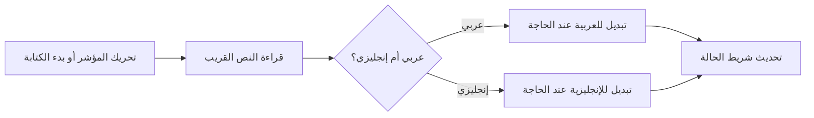

<div align="center">

# 🌐 مبدّل اللغة التلقائي لـ VS Code

<div align="center">


</div>

### تبديل تلقائي ذكي بين العربية والإنجليزية اعتمادًا على النص القريب من المؤشر

<div align="center">


</div>

---

</div>

## 📋 جدول المحتويات

<div align="center">

| القسم | الوصف |
|:-----:|:------|
| [🌟 نظرة عامة](#-نظرة-عامة) | ما الذي يقدمه الامتداد |
| [✨ الميزات](#-الميزات) | أهم القدرات |
| [📥 التثبيت](#-التثبيت) | التثبيت عبر VSIX |
| [🚀 الاستخدام](#-الاستخدام) | طريقة العمل داخل المحرر |
| [⌨️ اختصارات مفيدة](#️-اختصارات-مفيدة) | اختصارات VS Code |
| [⚙️ الإعدادات](#️-الإعدادات) | خيارات الامتداد |
| [🤝 المساهمة](#-المساهمة) | روابط المشاركة |
| [📞 الدعم](#-الدعم) | المساعدة والإبلاغ |
| [📄 الترخيص](#-الترخيص) | رخصة المشروع |

</div>

---

<div align="center">

# 🌟 نظرة عامة

<div style="background: linear-gradient(135deg, #667eea 0%, #764ba2 100%); padding: 20px; border-radius: 10px; color: white;">

> **مبدّل اللغة التلقائي** يكتشف لغة النص القريبة من المؤشر ويحوّل لغة الإدخال إلى العربية أو الإنجليزية فقط عند الحاجة.

</div>

</div>

<div align="center">

| القدرة | الوصف |
|:------:|:------|
| 🧠 | كشف ذكي من النص المحيط بالمؤشر |
| 🎯 | وزن أعلى للكلمة الموجودة عند المؤشر |
| 🔄 | معالجة السطور الجديدة الفارغة باستخدام أقرب سياق |
| ✅ | عدم التبديل إذا كانت اللغة الحالية صحيحة |
| 📊 | مؤشر حالة في شريط الحالة |
| 🔔 | إشعارات اختيارية عند التبديل |

</div>

---

<div align="center">

# ✨ الميزات

</div>

### 1️⃣ كشف ذكي قرب المؤشر

<div align="center">

```bash
┌─────────────────────────────────────────┐
│  يقرأ النص القريب من موضع المؤشر       │
│  يميّز العربية والإنجليزية بدقة         │
│  يتجنب قرارات غير دقيقة من السطر الكامل │
└─────────────────────────────────────────┘
```

</div>

### 2️⃣ منطق تبديل ذكي

<div align="center">

```bash
┌─────────────────────────────────────────┐
│  يتحول للعربية عند الحاجة               │
│  يتحول للإنجليزية عند الحاجة            │
│  لا ينفذ تبديلًا إذا كانت اللغة صحيحة   │
└─────────────────────────────────────────┘
```

</div>

### 3️⃣ دعم متعدد المنصات

<div align="center">

| المنصة | الحالة |
|:------:|:------:|
| 🪟 Windows | ✅ مدعوم |
| 🍎 macOS | ✅ مدعوم |
| 🐧 Linux | ✅ مدعوم |

</div>

---

<div align="center">

# 📥 التثبيت

</div>

### 📦 التثبيت من ملف VSIX

<div align="center">

<div style="background: linear-gradient(135deg, #f093fb 0%, #f5576c 100%); padding: 20px; border-radius: 10px; color: white;">

```
1️⃣ حمّل الملف autolanguage-0.0.6.vsix
2️⃣ افتح VS Code
3️⃣ افتح Command Palette
4️⃣ نفّذ: Extensions: Install from VSIX...
5️⃣ اختر الملف ✅
```

</div>

</div>

### التثبيت عبر الطرفية

```bash
code --install-extension autolanguage-0.0.6.vsix
```

---

<div align="center">

# 🚀 الاستخدام

</div>

### كيف يعمل


```mermaid
graph LR
    A[تحريك المؤشر أو بدء الكتابة] --> B[قراءة النص القريب]
    B --> C{عربي أم إنجليزي؟}
    C -->|عربي| D[تبديل للعربية عند الحاجة]
    C -->|إنجليزي| E[تبديل للإنجليزية عند الحاجة]
    D --> F[تحديث شريط الحالة]
    E --> F[تحديث شريط الحالة]
```

### سيناريو سريع

<div align="center">

| الخطوة | الإجراء |
|:------:|:--------|
| 1️⃣ | ضع المؤشر قرب نص عربي |
| 2️⃣ | يكتشف الامتداد اللغة العربية |
| 3️⃣ | يبدّل للعربية إذا لزم |
| 4️⃣ | انتقل إلى نص إنجليزي |
| 5️⃣ | يبدّل للإنجليزية إذا لزم |

</div>

---

<div align="center">

# ⌨️ اختصارات مفيدة

</div>

<div align="center">

| الإجراء | الاختصار |
|:-------:|:--------:|
| فتح لوحة الأوامر | `Ctrl+Shift+P` |
| فتح صفحة الامتدادات | `Ctrl+Shift+X` |
| فتح الإعدادات | `Ctrl+,` |
| إعادة تحميل النافذة | `Ctrl+Shift+P` ثم `Developer: Reload Window` |

</div>

---

<div align="center">

# ⚙️ الإعدادات

</div>

<div align="center">

| الإعداد | النوع | الافتراضي | الوصف |
|:-------:|:-----:|:---------:|:------|
| `autolanguage.enabled` | boolean | `true` | تشغيل/إيقاف التبديل التلقائي |
| `autolanguage.showNotifications` | boolean | `true` | عرض إشعار بعد التبديل |
| `autolanguage.showStatusBar` | boolean | `true` | عرض الحالة في شريط الحالة |

</div>

---

<div align="center">

# 🤝 المساهمة

</div>

<div align="center">

| نوع المساهمة | الرابط |
|:------------:|:------:|
| 🐛 الإبلاغ عن مشكلة | [Open Issue](https://github.com/almhajer/autolanguage/issues/new) |
| 💡 اقتراح ميزة | [Feature Request](https://github.com/almhajer/autolanguage/issues/new) |
| 🔧 المساهمة بالكود | [Pull Requests](https://github.com/almhajer/autolanguage/pulls) |

</div>

---

<div align="center">

# 📞 الدعم

للدعم والتحديثات:

[](https://github.com/almhajer/autolanguage)
[](https://marketplace.visualstudio.com/items?itemName=Arabic-language.autolanguage)

</div>

---

<div align="center">

# 📄 الترخيص

<div style="background: linear-gradient(135deg, #667eea 0%, #764ba2 100%); padding: 20px; border-radius: 10px; color: white;">

```bash
MIT License
راجع LICENSE.md للتفاصيل
```

</div>

</div>

---

<div align="center">

<div style="background: linear-gradient(135deg, #667eea 0%, #764ba2 100%); padding: 35px; border-radius: 18px; color: white; margin: 30px 0;">

### 🌟 إذا أعجبك الامتداد، لا تنسَ إضافة نجمة للمستودع

**صُمم لمطوري العربية والإنجليزية في VS Code**

</div>

</div>
