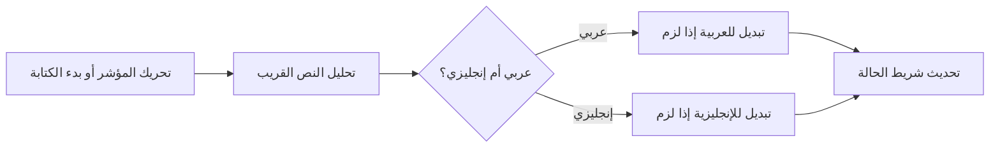
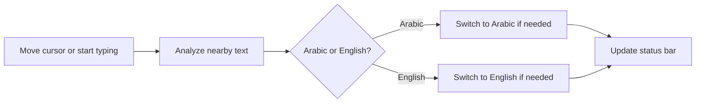

<div align="center">

# 🌐 مبدّل اللغة التلقائي لـ VS Code
# 🌐 Auto Language Switcher for VS Code

<div align="center">


[](LICENSE.md)

</div>

### إضافة ذكية تقوم بالتبديل التلقائي بين العربية والإنجليزية حسب النص القريب من المؤشر
### Smart extension that automatically switches between Arabic and English based on nearby cursor text

<div align="center">


</div>

[](#ar) [](#en)

</div>

---

<a id="ar"></a>

# 🇸🇦 العربية

## 📋 جدول المحتويات

<div align="center">

| القسم | الوصف |
|:-----:|:------|
| [🌟 نظرة عامة](#ar-overview) | تعرف على إضافة مبدّل اللغة التلقائي |
| [✨ المميزات](#ar-features) | اكتشف قدرات الإضافة |
| [📥 التثبيت](#ar-installation) | كيفية تثبيت الإضافة |
| [🚀 الاستخدام](#ar-usage) | طريقة العمل داخل المحرر |
| [⌨️ اختصارات مفيدة](#ar-shortcuts) | اختصارات سريعة |
| [⚙️ الإعدادات](#ar-settings) | إعدادات التخصيص |
| [🤝 المساهمة](#ar-contributing) | كيف تساهم في التطوير |
| [📞 الدعم](#ar-support) | روابط الدعم والمساعدة |
| [📄 الترخيص](#ar-license) | معلومات الرخصة |

</div>

---

<div align="center">

<a id="ar-overview"></a>

# 🌟 نظرة عامة

<div style="background: linear-gradient(135deg, #667eea 0%, #764ba2 100%); padding: 20px; border-radius: 10px; color: white;">

> **مبدّل اللغة التلقائي** هو امتداد لـ Visual Studio Code يكتشف اللغة من النص المحيط بالمؤشر ويحوّل لغة الإدخال إلى العربية أو الإنجليزية فقط عند الحاجة.

</div>

### 🎯 لماذا هذه الإضافة؟

</div>

<div align="center">

| الميزة | الوصف |
|:------:|:------|
| 🧠 | **كشف ذكي** - يعتمد على سياق النص القريب من المؤشر |
| 🎯 | **دقة أعلى** - يعطي وزنًا إضافيًا للكلمة عند المؤشر |
| 🔄 | **سلاسة العمل** - يتعامل مع السطر الجديد الفارغ بذكاء |
| ✅ | **تجنب التبديل الخاطئ** - لا يبدّل إذا اللغة الحالية صحيحة |
| 🌍 | **دعم متعدد الأنظمة** - Windows و macOS و Linux |

</div>

---

<div align="center">

<a id="ar-features"></a>

# ✨ المميزات

</div>

### 1️⃣ كشف ذكي قرب المؤشر

<div align="center">

<div style="background: linear-gradient(135deg, #667eea 0%, #764ba2 100%); padding: 25px; border-radius: 15px; color: white; box-shadow: 0 10px 30px rgba(0,0,0,0.2); margin: 20px 0;">

| الميزة |
|:------|
| 📍 يقرأ النص القريب من موضع المؤشر |
| 🔤 يميز العربية والإنجليزية بدقة |
| 🎯 يتجنب قرارات غير دقيقة من السطر الكامل |

</div>

</div>

### 2️⃣ منطق تبديل ذكي

<div align="center">

<div style="background: linear-gradient(135deg, #f093fb 0%, #f5576c 100%); padding: 25px; border-radius: 15px; color: white; box-shadow: 0 10px 30px rgba(0,0,0,0.2); margin: 20px 0;">

| السلوك |
|:------|
| 🇸🇦 يتحول للعربية عند الحاجة |
| 🇬🇧 يتحول للإنجليزية عند الحاجة |
| 🚫 لا ينفذ تبديلًا إذا كانت اللغة الحالية صحيحة |

</div>

</div>

### 3️⃣ دعم متعدد المنصات

<div align="center">

| المنصة | طريقة التنفيذ | الحالة |
|:------:|:-------------:|:------:|
| 🪟 Windows | PowerShell + Win32 API | ✅ مدعوم |
| 🍎 macOS | AppleScript / Input Sources | ✅ مدعوم |
| 🐧 Linux | gsettings / setxkbmap / ibus / fcitx | ✅ مدعوم |

</div>

---

<div align="center">

<a id="ar-installation"></a>

# 📥 التثبيت

</div>

### 📦 من ملف VSIX

<div align="center">

<div style="background: linear-gradient(135deg, #f093fb 0%, #f5576c 100%); padding: 30px; border-radius: 15px; color: white; box-shadow: 0 10px 30px rgba(0,0,0,0.2); margin: 20px 0;">

| الخطوة | الإجراء |
|:------:|:--------|
| 1️⃣ | حمّل الملف `autolanguage-0.0.9.vsix` |
| 2️⃣ | افتح VS Code |
| 3️⃣ | اضغط `Ctrl+Shift+P` (أو `Cmd+Shift+P` على Mac) |
| 4️⃣ | اكتب `Extensions: Install from VSIX...` |
| 5️⃣ | اختر الملف المحمّل ✅ |

</div>

</div>

### ⌨️ التثبيت عبر الطرفية

```bash
code --install-extension autolanguage-0.0.9.vsix
```

<div align="center">

[](https://github.com/almhajer/autolanguage/releases/tag/v0.0.9)

</div>

---

<div align="center">

<a id="ar-usage"></a>

# 🚀 الاستخدام

</div>

### 🎬 كيف يعمل الامتداد


```mermaid
graph LR
    A[تحريك المؤشر أو بدء الكتابة] --> B[تحليل النص القريب]
    B --> C{عربي أم إنجليزي؟}
    C -->|عربي| D[تبديل للعربية إذا لزم]
    C -->|إنجليزي| E[تبديل للإنجليزية إذا لزم]
    D --> F[تحديث شريط الحالة]
    E --> F[تحديث شريط الحالة]
```

### 📝 خطوات سريعة

<div align="center">

| الخطوة | الإجراء |
|:------:|:--------|
| 1️⃣ | ضع المؤشر قرب نص عربي |
| 2️⃣ | سيكتشف الامتداد اللغة العربية |
| 3️⃣ | سيحوّل لغة الإدخال للعربية عند الحاجة |
| 4️⃣ | انتقل إلى نص إنجليزي |
| 5️⃣ | سيحوّل لغة الإدخال للإنجليزية عند الحاجة |

</div>

---

<div align="center">

<a id="ar-shortcuts"></a>

# ⌨️ اختصارات مفيدة

</div>

<div align="center">

| الإجراء | الاختصار |
|:-------:|:--------:|
| فتح لوحة الأوامر | `Ctrl+Shift+P` |
| فتح صفحة الإضافات | `Ctrl+Shift+X` |
| فتح الإعدادات | `Ctrl+,` |
| إعادة تحميل VS Code | `Ctrl+Shift+P` → `Developer: Reload Window` |

</div>

---

<div align="center">

<a id="ar-settings"></a>

# ⚙️ الإعدادات

</div>

<div align="center">

| الإعداد | النوع | الافتراضي | الوصف |
|:-------:|:-----:|:---------:|:------|
| `autolanguage.enabled` | boolean | `true` | تمكين/تعطيل الامتداد |
| `autolanguage.showNotifications` | boolean | `true` | عرض الإشعارات عند التبديل |
| `autolanguage.showStatusBar` | boolean | `true` | عرض حالة اللغة في شريط الحالة |

</div>

---

<div align="center">

<a id="ar-contributing"></a>

# 🤝 المساهمة

<div style="background: linear-gradient(135deg, #667eea 0%, #764ba2 100%); padding: 30px; border-radius: 15px; color: white; margin-bottom: 20px;">

### نرحّب بمساهماتكم! 🙌

</div>

</div>

<div align="center">

| نوع المساهمة | الرابط |
|:------------:|:------:|
| 🐛 الإبلاغ عن مشكلة | [فتح Issue](https://github.com/almhajer/autolanguage/issues/new) |
| 💡 طلب ميزة جديدة | [طلب Feature](https://github.com/almhajer/autolanguage/issues/new) |
| 🔧 المساهمة في الكود | [فتح Pull Request](https://github.com/almhajer/autolanguage/pulls) |

</div>

---

<div align="center">

<a id="ar-support"></a>

# 📞 الدعم

</div>

<div align="center">

| الرابط | الوصف |
|:------:|:------|
| [](https://github.com/almhajer/autolanguage) | المستودع الرسمي |
| [](https://marketplace.visualstudio.com/items?itemName=Arabic-language.autolanguage) | صفحة الإضافة |
| [](https://marketplace.visualstudio.com/publishers/Arabic-language) | جميع إضافات الناشر |

</div>

---

<div align="center">

<a id="ar-license"></a>

# 📄 الترخيص

<div style="background: linear-gradient(135deg, #667eea 0%, #764ba2 100%); padding: 20px; border-radius: 10px; color: white;">

### MIT License

مرخّص بموجب **رخصة MIT**.

راجع ملف [LICENSE.md](LICENSE.md) للاطلاع على التفاصيل الكاملة.

</div>

</div>

---

<a id="en"></a>

# 🇬🇧 English

## 📋 Table of Contents

<div align="center">

| Section | Description |
|:------:|:------------|
| [🌟 Overview](#en-overview) | Learn what Auto Language Switcher does |
| [✨ Features](#en-features) | Explore extension capabilities |
| [📥 Installation](#en-installation) | How to install the extension |
| [🚀 Usage](#en-usage) | How it works in the editor |
| [⌨️ Useful Shortcuts](#en-shortcuts) | Quick productivity shortcuts |
| [⚙️ Settings](#en-settings) | Available customization options |
| [🤝 Contributing](#en-contributing) | How to contribute |
| [📞 Support](#en-support) | Help and links |
| [📄 License](#en-license) | Licensing details |

</div>

---

<div align="center">

<a id="en-overview"></a>

# 🌟 Overview

<div style="background: linear-gradient(135deg, #667eea 0%, #764ba2 100%); padding: 20px; border-radius: 10px; color: white;">

> **Auto Language Switcher** is a Visual Studio Code extension that detects language from text around the cursor and switches your input language to Arabic or English only when needed.

</div>

### 🎯 Why this extension?

</div>

<div align="center">

| Benefit | Description |
|:------:|:------------|
| 🧠 | **Smart detection** based on nearby cursor context |
| 🎯 | **Higher accuracy** with extra weight for the active word |
| 🔄 | **Smooth editing flow** with new-line awareness |
| ✅ | **Fewer false switches** by checking current layout first |
| 🌍 | **Cross-platform support** for Windows, macOS, and Linux |

</div>

---

<div align="center">

<a id="en-features"></a>

# ✨ Features

</div>

### 1️⃣ Smart Cursor-Proximity Detection

<div align="center">

<div style="background: linear-gradient(135deg, #667eea 0%, #764ba2 100%); padding: 25px; border-radius: 15px; color: white; box-shadow: 0 10px 30px rgba(0,0,0,0.2); margin: 20px 0;">

| Feature |
|:-------|
| 📍 Reads text around current cursor position |
| 🔤 Detects Arabic and English accurately |
| 🎯 Avoids noisy full-line decisions |

</div>

</div>

### 2️⃣ Smart Switching Logic

<div align="center">

<div style="background: linear-gradient(135deg, #f093fb 0%, #f5576c 100%); padding: 25px; border-radius: 15px; color: white; box-shadow: 0 10px 30px rgba(0,0,0,0.2); margin: 20px 0;">

| Behavior |
|:--------|
| 🇸🇦 Switches to Arabic when needed |
| 🇬🇧 Switches to English when needed |
| 🚫 Skips switching when layout is already correct |

</div>

</div>

### 3️⃣ Cross-Platform Support

<div align="center">

| Platform | Implementation | Status |
|:--------:|:--------------:|:------:|
| 🪟 Windows | PowerShell + Win32 API | ✅ Supported |
| 🍎 macOS | AppleScript / Input Sources | ✅ Supported |
| 🐧 Linux | gsettings / setxkbmap / ibus / fcitx | ✅ Supported |

</div>

---

<div align="center">

<a id="en-installation"></a>

# 📥 Installation

</div>

### 📦 Install from VSIX

<div align="center">

<div style="background: linear-gradient(135deg, #f093fb 0%, #f5576c 100%); padding: 30px; border-radius: 15px; color: white; box-shadow: 0 10px 30px rgba(0,0,0,0.2); margin: 20px 0;">

| Step | Action |
|:----:|:-------|
| 1️⃣ | Download `autolanguage-0.0.9.vsix` |
| 2️⃣ | Open VS Code |
| 3️⃣ | Press `Ctrl+Shift+P` (or `Cmd+Shift+P` on macOS) |
| 4️⃣ | Run `Extensions: Install from VSIX...` |
| 5️⃣ | Select the downloaded file ✅ |

</div>

</div>

### ⌨️ Install via Terminal

```bash
code --install-extension autolanguage-0.0.9.vsix
```

<div align="center">

[](https://github.com/almhajer/autolanguage/releases/tag/v0.0.9)

</div>

---

<div align="center">

<a id="en-usage"></a>

# 🚀 Usage

</div>

### 🎬 How the Extension Works


```mermaid
graph LR
    A[Move cursor or start typing] --> B[Analyze nearby text]
    B --> C{Arabic or English?}
    C -->|Arabic| D[Switch to Arabic if needed]
    C -->|English| E[Switch to English if needed]
    D --> F[Update status bar]
    E --> F[Update status bar]
```

### 📝 Quick Steps

<div align="center">

| Step | Action |
|:----:|:-------|
| 1️⃣ | Place cursor near Arabic text |
| 2️⃣ | Extension detects Arabic context |
| 3️⃣ | Input switches to Arabic when required |
| 4️⃣ | Move to English text |
| 5️⃣ | Input switches back to English when required |

</div>

---

<div align="center">

<a id="en-shortcuts"></a>

# ⌨️ Useful Shortcuts

</div>

<div align="center">

| Action | Shortcut |
|:------:|:--------:|
| Open Command Palette | `Ctrl+Shift+P` |
| Open Extensions View | `Ctrl+Shift+X` |
| Open Settings | `Ctrl+,` |
| Reload VS Code | `Ctrl+Shift+P` → `Developer: Reload Window` |

</div>

---

<div align="center">

<a id="en-settings"></a>

# ⚙️ Settings

</div>

<div align="center">

| Setting | Type | Default | Description |
|:------:|:----:|:------:|:------------|
| `autolanguage.enabled` | boolean | `true` | Enable/disable the extension |
| `autolanguage.showNotifications` | boolean | `true` | Show switch notifications |
| `autolanguage.showStatusBar` | boolean | `true` | Display current language in status bar |

</div>

---

<div align="center">

<a id="en-contributing"></a>

# 🤝 Contributing

<div style="background: linear-gradient(135deg, #667eea 0%, #764ba2 100%); padding: 30px; border-radius: 15px; color: white; margin-bottom: 20px;">

### Contributions are welcome! 🙌

</div>

</div>

<div align="center">

| Contribution Type | Link |
|:-----------------:|:----:|
| 🐛 Report a bug | [Open Issue](https://github.com/almhajer/autolanguage/issues/new) |
| 💡 Request a feature | [Feature Request](https://github.com/almhajer/autolanguage/issues/new) |
| 🔧 Submit code changes | [Open Pull Request](https://github.com/almhajer/autolanguage/pulls) |

</div>

---

<div align="center">

<a id="en-support"></a>

# 📞 Support

</div>

<div align="center">

| Link | Description |
|:----:|:------------|
| [](https://github.com/almhajer/autolanguage) | Official repository |
| [](https://marketplace.visualstudio.com/items?itemName=Arabic-language.autolanguage) | Extension listing |
| [](https://marketplace.visualstudio.com/publishers/Arabic-language) | Publisher extensions |

</div>

---

<div align="center">

<a id="en-license"></a>

# 📄 License

<div style="background: linear-gradient(135deg, #667eea 0%, #764ba2 100%); padding: 20px; border-radius: 10px; color: white;">

### MIT License

Licensed under the **MIT License**.

See [LICENSE.md](LICENSE.md) for full details.

</div>

</div>

---

<div align="center">

<div style="background: linear-gradient(135deg, #667eea 0%, #764ba2 100%); padding: 40px; border-radius: 20px; color: white; margin: 30px 0;">

### 🌟 If you like this project, leave a star

**Built with care for Arabic-speaking developers**

</div>

</div>
