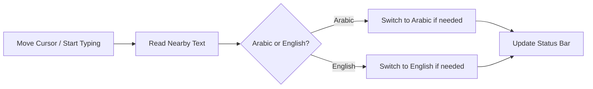

<div align="center">

# 🌐 Auto Language Switcher for VS Code

<div align="center">


</div>

### Smart automatic keyboard language switching between **Arabic** and **English** based on text near the cursor

<div align="center">


</div>

---

</div>

## 📋 Table of Contents

<div align="center">

| Section | Description |
|:-------:|:-----------|
| [🌟 Overview](#-overview) | What this extension does |
| [✨ Features](#-features) | Main capabilities |
| [📥 Installation](#-installation) | Install from VSIX |
| [🚀 Usage](#-usage) | How it works in the editor |
| [⌨️ Useful Shortcuts](#️-useful-shortcuts) | Helpful VS Code shortcuts |
| [⚙️ Configuration](#️-configuration) | Extension settings |
| [🤝 Contributing](#-contributing) | Contribution links |
| [📞 Support](#-support) | Support and issue reporting |
| [📄 License](#-license) | Project license |

</div>

---

<div align="center">

# 🌟 Overview

<div style="background: linear-gradient(135deg, #667eea 0%, #764ba2 100%); padding: 20px; border-radius: 10px; color: white;">

> **Auto Language Switcher** detects nearby text language and switches the system input source to Arabic or English only when needed.

</div>

</div>

<div align="center">

| Capability | Description |
|:----------:|:-----------|
| 🧠 | Smart detection from text around the cursor |
| 🎯 | Extra weight for the focused word at cursor |
| 🔄 | Handles empty new lines using nearest context |
| ✅ | Skips switching when current input already matches |
| 📊 | Status bar indicator for detected language |
| 🔔 | Optional switch notifications |

</div>

---

<div align="center">

# ✨ Features

</div>

### 1️⃣ Smart detection near cursor

<div align="center">

```bash
┌─────────────────────────────────────────┐
│  Reads text near cursor position        │
│  Detects Arabic / English accurately    │
│  Avoids noisy full-line-only decisions  │
└─────────────────────────────────────────┘
```

</div>

### 2️⃣ Intelligent switching logic

<div align="center">

```bash
┌─────────────────────────────────────────┐
│  Switch to Arabic when Arabic is needed │
│  Switch to English when English is needed│
│  No switch if current layout is correct │
└─────────────────────────────────────────┘
```

</div>

### 3️⃣ Cross-platform support

<div align="center">

| Platform | Status |
|:--------:|:------:|
| 🪟 Windows | ✅ Supported |
| 🍎 macOS | ✅ Supported |
| 🐧 Linux | ✅ Supported |

</div>

---

<div align="center">

# 📥 Installation

</div>

### 📦 From VSIX file

<div align="center">

<div style="background: linear-gradient(135deg, #f093fb 0%, #f5576c 100%); padding: 20px; border-radius: 10px; color: white;">

```
1️⃣ Download autolanguage-0.0.6.vsix
2️⃣ Open VS Code
3️⃣ Open Command Palette
4️⃣ Run: Extensions: Install from VSIX...
5️⃣ Select the downloaded file ✅
```

</div>

</div>

### Terminal install

```bash
code --install-extension autolanguage-0.0.6.vsix
```

---

<div align="center">

# 🚀 Usage

</div>

### How it works



### Typical flow

<div align="center">

| Step | Action |
|:----:|:-------|
| 1️⃣ | Place cursor near Arabic text |
| 2️⃣ | Extension detects Arabic |
| 3️⃣ | Input switches to Arabic if required |
| 4️⃣ | Move to English text |
| 5️⃣ | Input switches to English if required |

</div>

---

<div align="center">

# ⌨️ Useful Shortcuts

</div>

<div align="center">

| Action | Shortcut |
|:------:|:--------:|
| Open Command Palette | `Ctrl+Shift+P` |
| Open Extensions View | `Ctrl+Shift+X` |
| Open Settings | `Ctrl+,` |
| Reload Window | `Ctrl+Shift+P` then `Developer: Reload Window` |

</div>

---

<div align="center">

# ⚙️ Configuration

</div>

<div align="center">

| Setting | Type | Default | Description |
|:-------:|:----:|:-------:|:------------|
| `autolanguage.enabled` | boolean | `true` | Enable/disable automatic switching |
| `autolanguage.showNotifications` | boolean | `true` | Show notification after switching |
| `autolanguage.showStatusBar` | boolean | `true` | Show current state in status bar |

</div>

---

<div align="center">

# 🤝 Contributing

</div>

<div align="center">

| Contribution Type | Link |
|:-----------------:|:----:|
| 🐛 Report an Issue | [Open Issue](https://github.com/almhajer/autolanguage/issues/new) |
| 💡 Request a Feature | [Feature Request](https://github.com/almhajer/autolanguage/issues/new) |
| 🔧 Contribute Code | [Pull Requests](https://github.com/almhajer/autolanguage/pulls) |

</div>

---

<div align="center">

# 📞 Support

For support and updates:

[](https://github.com/almhajer/autolanguage)
[](https://marketplace.visualstudio.com/items?itemName=Arabic-language.autolanguage)

</div>

---

<div align="center">

# 📄 License

<div style="background: linear-gradient(135deg, #667eea 0%, #764ba2 100%); padding: 20px; border-radius: 10px; color: white;">

```bash
MIT License
See LICENSE.md for details
```

</div>

</div>

---

<div align="center">

<div style="background: linear-gradient(135deg, #667eea 0%, #764ba2 100%); padding: 35px; border-radius: 18px; color: white; margin: 30px 0;">

### 🌟 If this extension helps you, consider giving the repo a star

**Made for Arabic-English developers using VS Code**

</div>

</div>
