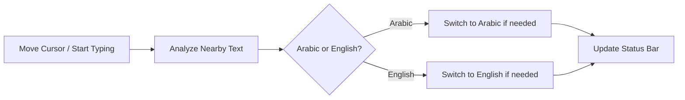

<div align="center">

# 🌐 Auto Language Switcher for VS Code

<div align="center">


</div>

### A smart extension that automatically switches keyboard input between **Arabic** and **English** based on text near the cursor

<div align="center">


</div>

---

</div>

## 📋 Table of Contents

<div align="center">

| Section | Description |
|:-------:|:-----------|
| [🌟 Overview](#-overview) | Learn what Auto Language does |
| [✨ Features](#-features) | Core extension capabilities |
| [📥 Installation](#-installation) | Install from VSIX |
| [🚀 Usage](#-usage) | How it works in editor |
| [⌨️ Useful Shortcuts](#️-useful-shortcuts) | Quick VS Code shortcuts |
| [⚙️ Configuration](#️-configuration) | Extension settings |
| [🤝 Contributing](#-contributing) | How to contribute |
| [📞 Support](#-support) | Help and useful links |
| [📄 License](#-license) | License information |

</div>

---

<div align="center">

# 🌟 Overview

<div style="background: linear-gradient(135deg, #667eea 0%, #764ba2 100%); padding: 20px; border-radius: 10px; color: white;">

> **Auto Language Switcher** detects language from text around the cursor and switches the system input source only when needed.

</div>

### 🎯 Why this extension?

</div>

<div align="center">

| Feature | Description |
|:-------:|:-----------|
| 🧠 | **Smart detection** from nearby cursor context |
| 🎯 | **Higher precision** by weighting the focused word |
| 🔄 | **Smooth flow** on empty new lines using nearest context |
| ✅ | **No unnecessary switches** when current input is already correct |
| 🌍 | **Cross-platform support** for Windows, macOS, and Linux |

</div>

---

<div align="center">

# ✨ Features

</div>

### 1️⃣ Smart detection near cursor

<div align="center">

<div style="background: linear-gradient(135deg, #667eea 0%, #764ba2 100%); padding: 25px; border-radius: 15px; color: white; box-shadow: 0 10px 30px rgba(0,0,0,0.2); margin: 20px 0;">

| Feature |
|:--------|
| 📍 Reads text near cursor position |
| 🔤 Detects Arabic and English accurately |
| 🎯 Avoids noisy full-line-only decisions |

</div>

</div>

### 2️⃣ Intelligent switching logic

<div align="center">

<div style="background: linear-gradient(135deg, #f093fb 0%, #f5576c 100%); padding: 25px; border-radius: 15px; color: white; box-shadow: 0 10px 30px rgba(0,0,0,0.2); margin: 20px 0;">

| Behavior |
|:---------|
| 🇸🇦 Switches to Arabic when needed |
| 🇬🇧 Switches to English when needed |
| 🚫 Skips switching when current input is already correct |

</div>

</div>

### 3️⃣ Cross-platform support

<div align="center">

| Platform | Implementation | Status |
|:--------:|:--------------:|:------:|
| 🪟 Windows | PowerShell + Win32 API | ✅ Supported |
| 🍎 macOS | AppleScript / Input Sources | ✅ Supported |
| 🐧 Linux | gsettings / setxkbmap / ibus / fcitx | ✅ Supported |

</div>

---

<div align="center">

# 📥 Installation

</div>

### 📦 From VSIX file

<div align="center">

<div style="background: linear-gradient(135deg, #f093fb 0%, #f5576c 100%); padding: 30px; border-radius: 15px; color: white; box-shadow: 0 10px 30px rgba(0,0,0,0.2); margin: 20px 0;">

| Step | Action |
|:----:|:-------|
| 1️⃣ | Download `autolanguage-0.0.6.vsix` |
| 2️⃣ | Open VS Code |
| 3️⃣ | Press `Ctrl+Shift+P` (or `Cmd+Shift+P` on Mac) |
| 4️⃣ | Run `Extensions: Install from VSIX...` |
| 5️⃣ | Select the downloaded file ✅ |

</div>

</div>

### ⌨️ Terminal install

```bash
code --install-extension autolanguage-0.0.6.vsix
```

<div align="center">

[](https://github.com/almhajer/autolanguage/releases/tag/v0.0.6)

</div>

---

<div align="center">

# 🚀 Usage

</div>

### 🎬 How the extension works



### 📝 Quick flow

<div align="center">

| Step | Action |
|:----:|:-------|
| 1️⃣ | Place cursor near Arabic text |
| 2️⃣ | Extension detects Arabic |
| 3️⃣ | Input switches to Arabic when needed |
| 4️⃣ | Move to English text |
| 5️⃣ | Input switches to English when needed |

</div>

---

<div align="center">

# ⌨️ Useful Shortcuts

</div>

<div align="center">

| Action | Shortcut |
|:------:|:--------:|
| Open Command Palette | `Ctrl+Shift+P` |
| Open Extensions View | `Ctrl+Shift+X` |
| Open Settings | `Ctrl+,` |
| Reload VS Code | `Ctrl+Shift+P` → `Developer: Reload Window` |

</div>

---

<div align="center">

# ⚙️ Configuration

</div>

<div align="center">

| Setting | Type | Default | Description |
|:-------:|:----:|:-------:|:------------|
| `autolanguage.enabled` | boolean | `true` | Enable/disable extension |
| `autolanguage.showNotifications` | boolean | `true` | Show notifications when switching |
| `autolanguage.showStatusBar` | boolean | `true` | Show language status in status bar |

</div>

---

<div align="center">

# 🤝 Contributing

<div style="background: linear-gradient(135deg, #667eea 0%, #764ba2 100%); padding: 30px; border-radius: 15px; color: white; margin-bottom: 20px;">

### Contributions are welcome! 🙌

</div>

</div>

<div align="center">

| Contribution Type | Link |
|:-----------------:|:----:|
| 🐛 Report a bug | [Open Issue](https://github.com/almhajer/autolanguage/issues/new) |
| 💡 Request a feature | [Feature Request](https://github.com/almhajer/autolanguage/issues/new) |
| 🔧 Contribute code | [Pull Requests](https://github.com/almhajer/autolanguage/pulls) |

</div>

---

<div align="center">

# 📞 Support

</div>

<div align="center">

| Link | Description |
|:----:|:-----------|
| [](https://github.com/almhajer/autolanguage) | Official repository |
| [](https://marketplace.visualstudio.com/items?itemName=Arabic-language.autolanguage) | Extension page |
| [](https://marketplace.visualstudio.com/publishers/Arabic-language) | All publisher extensions |

</div>

---

<div align="center">

# 📄 License

</div>

<div align="center">

<div style="background: linear-gradient(135deg, #667eea 0%, #764ba2 100%); padding: 20px; border-radius: 10px; color: white;">

```bash
MIT License
This project is licensed under MIT
See LICENSE.md for details
```

</div>

</div>

---

<div align="center">

<div style="background: linear-gradient(135deg, #667eea 0%, #764ba2 100%); padding: 40px; border-radius: 20px; color: white; margin: 30px 0;">

### 🌟 If you like the project, don't forget to star it

**Made with ❤️ for the Arabic developer community**

</div>

</div>
